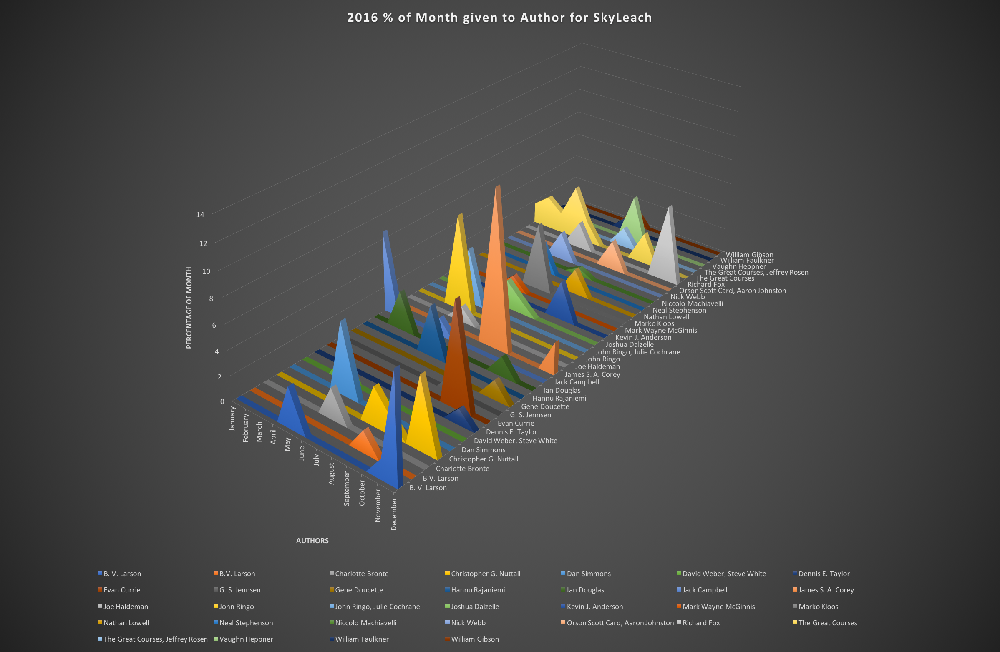

# Audible.com 'My Library' data extractor to CSV

This is a one-off quick script (hack) to export information from the 'My Library' section on audible.com.

I used it to get a visual representation of my time spent listening to various authors for a specific range of time.

Once the data is extracted, I use [audible_percentage_of_month.py](../../scripts/oneoff/audible_percentage_of_month.py) to clean up and format the data for import into Microsoft Excel.

This is the result from Excel:

